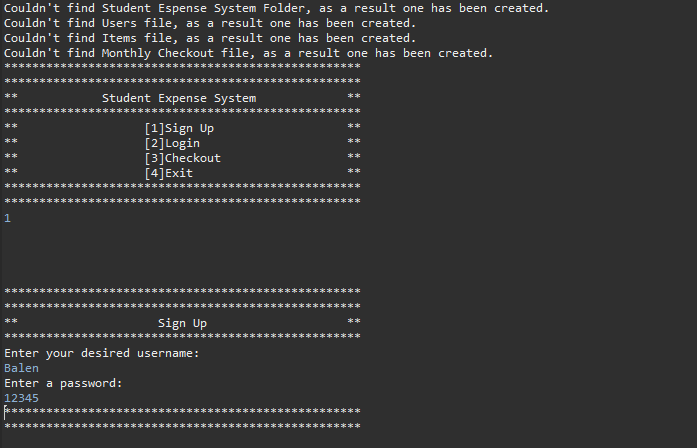
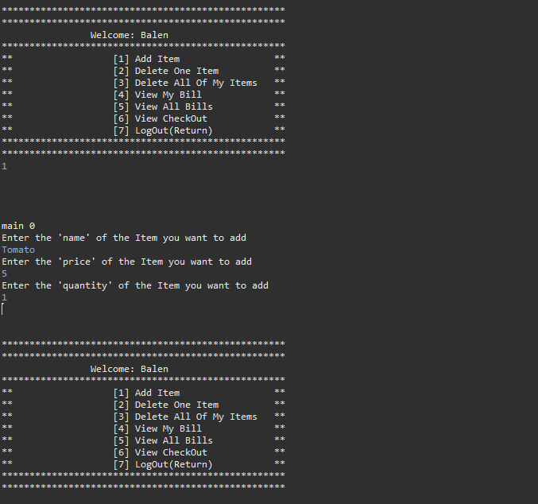
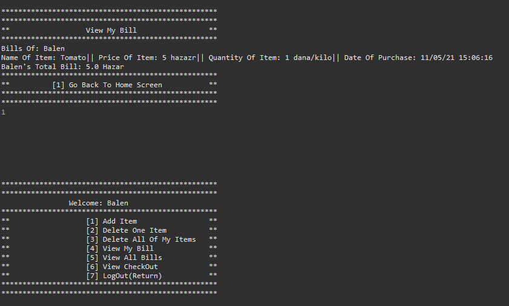

A Console-based Student Expense System that uses files as a mean of storing data.

Only change folder's path to make it work, It will automatically create necessary folder and all other required files.
static File path = new File("C:\\Users\\balen\\OneDrive\\Desktop\\Assignment\\Student Espense System");

