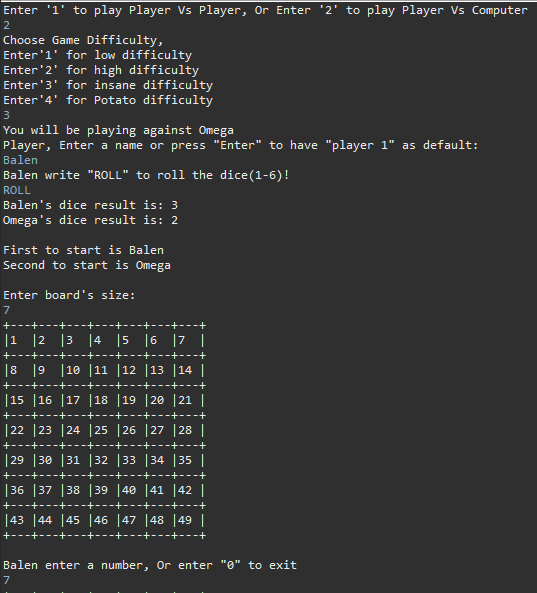
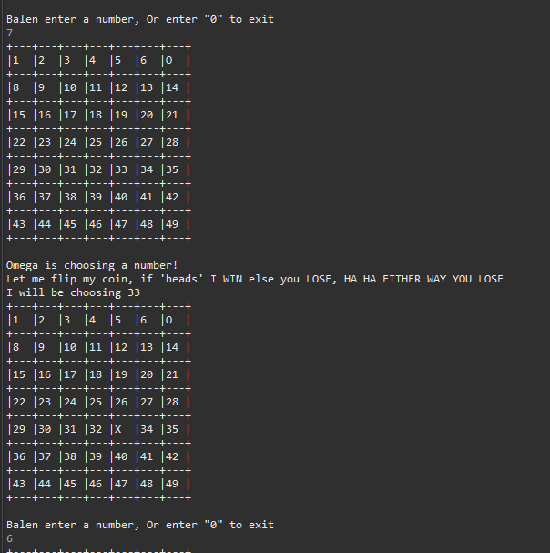
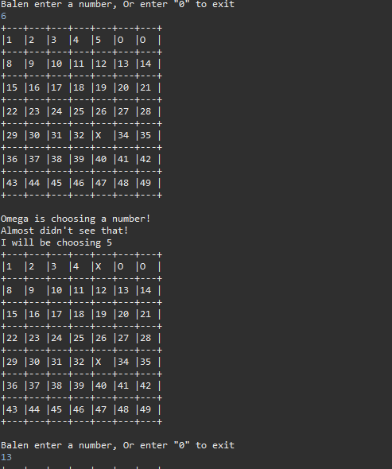
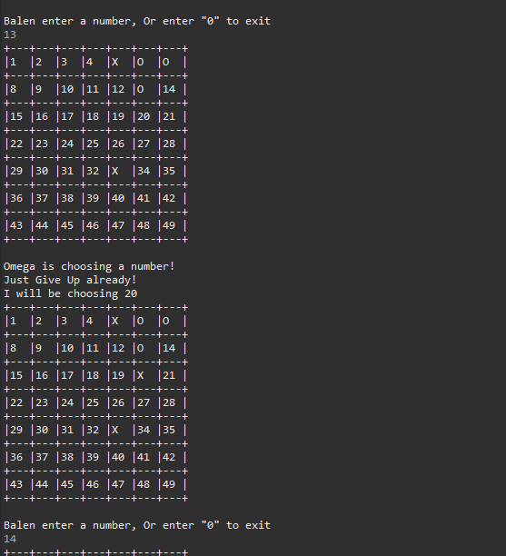
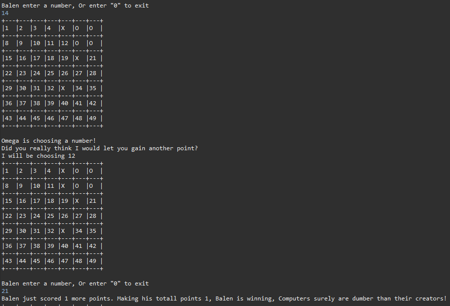

A console-based Tic_Tac-Toe with a slight difference from traditional ones where the board is a fixed 3 by 3.
Here one can choose the game mode(player against player or player against computer), names, and board size.

